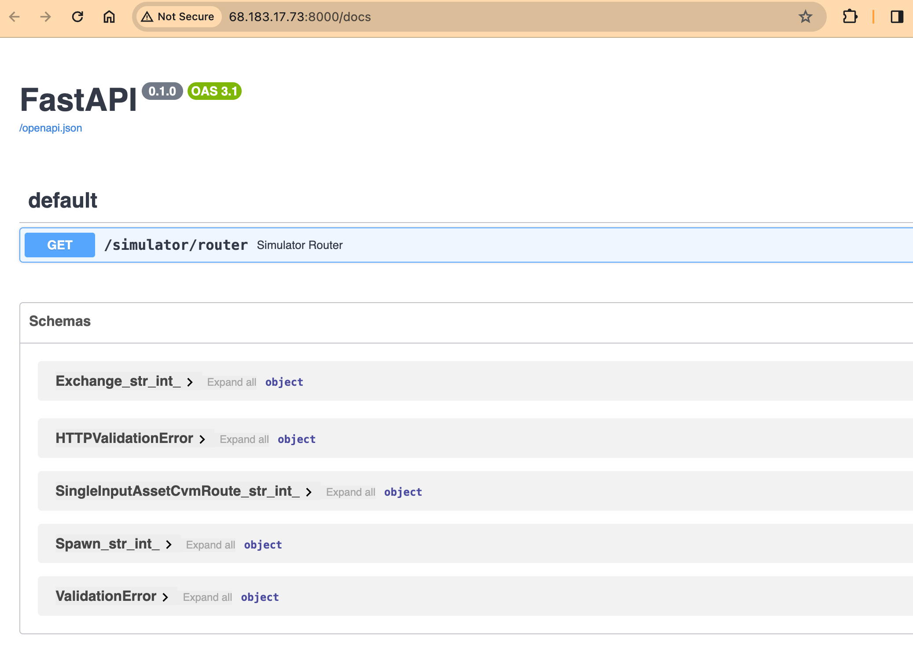

# Provision Solver

## Prerequisites

- Digital Ocean account
- [Terraform v1.4.2+](https://developer.hashicorp.com/terraform/install)

## Digital Ocean

Generate PAT in Digital Ocean's console panel:
- In the left menu, click API, which takes you to the Applications & API page on the Tokens tab. In the Personal access tokens section, click the Generate New Token button.

[How to Create a Personal Access Token](https://docs.digitalocean.com/reference/api/create-personal-access-token/)

export your Digital Ocean's Personal Access token
```bash
export DO_PAT="your_personal_access_token"
```

### Provision droplet

Use bash wrapper to provision droplet
```bash
./provision.sh
```

At the end of provisioning script you wil find some info about your deployment:
```
Apply complete! Resources: 3 added, 1 changed, 1 destroyed.

Outputs:

droplet_id = "406459888"
ipv4_address = "134.122.118.208"
ipv4_address_private = "10.116.0.3"
name = "ubuntu-nyc1-node-01"
region = "nyc1"
size = "s-1vcpu-1gb"
tags = toset([
  "mantis",
  "solver",
])
```

Not `ipv4_address` to access droplet in next step.

### Access droplet

To access droplet, use your keyfile
```bash
ssh -i path_to_prv_file root@<ip_of_droplet>
```

```bash
ssh -i ~/.ssh/do_test_id_rsa root@134.122.118.208
```

Together with provisioning of droplet, following tools are installed and setup via `cloudinit`:

```bash
composable@ubuntu-nyc1-node-01:~$ python --version
Python 3.11.7
```

```bash
composable@ubuntu-nyc1-node-01:~$ poetry --version
Poetry (version 1.8.2)
```

### Run solver

In order to run solver, ssh into droplet and start project via projectry command:

- switch to `composable` user
```bash
su - composable
```

- run poetry commands
```bash
cd composable-vm/mantis/
poetry install
poetry run blackbox
```

at the end you will see:
```
INFO:     Uvicorn running on http://0.0.0.0:8000 (Press CTRL+C to quit)
INFO:     Started reloader process [41097] using WatchFiles
INFO:     Started server process [41103]
INFO:     Waiting for application startup.
TRACE:    ASGI [1] Started scope={'type': 'lifespan', 'asgi': {'version': '3.0', 'spec_version': '2.0'}, 'state': {}}
TRACE:    ASGI [1] Receive {'type': 'lifespan.startup'}
TRACE:    ASGI [1] Send {'type': 'lifespan.startup.complete'}
INFO:     Application startup complete.
```


Visit: http://<ip_of_droplet>:8000/docs

You should see something like:




### Destroy infrastructure

If you don't need that infrastructure anymore, you can use:
```bash
./destroy.sh
```
to decommision all components of infrasture.